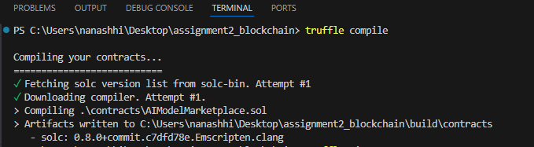
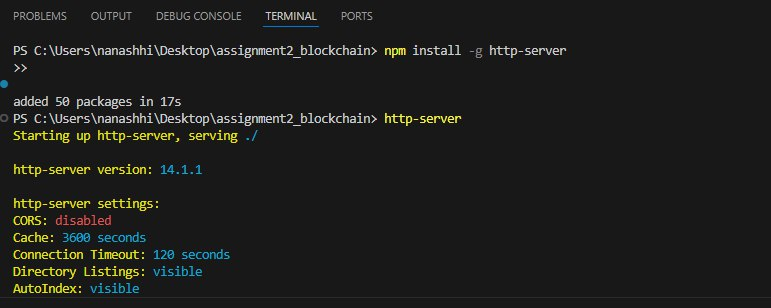
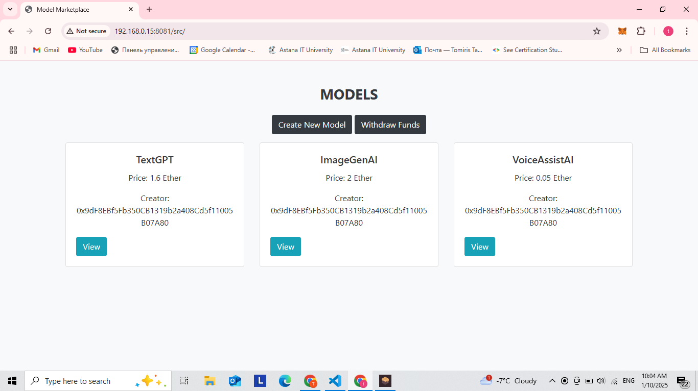
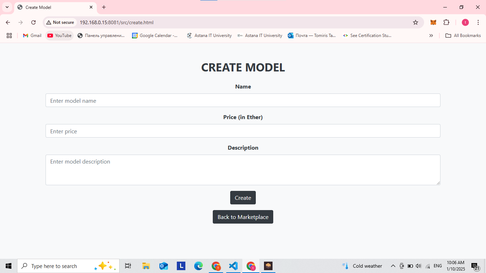
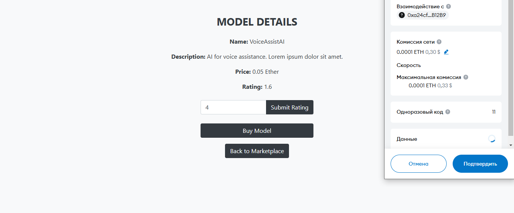

# BlockchainAssignment2
## Team: Ayaulym Kenzhekul, Tomiris Tapen, Danial Yerzhigit
## AI Model Marketplace dApp
## Overview
The AI Model Marketplace dApp is a decentralized application designed to allow users to list, purchase, and rate AI models. This project includes a smart contract that manages core marketplace functions and a frontend interface for seamless user interaction.

## Features

Smart Contract Functionalities:

- List a Model: Add AI models with name, description, and price.
- Purchase a Model: Buy a listed AI model by ID, transferring payment to the model creator.
- Rate a Model: Submit a rating for a purchased model.
- View Model Details: Retrieve model information, including name, description, price, creator, and average rating.
- Withdraw Funds: Allow creators to withdraw accumulated funds from sales.

## Frontend Functionalities:
Form to list a new model.
List/grid view of available models.
Buttons to purchase and rate models.
Button to view model details.
Withdrawal option for creators.

## Installation
Prerequisites:
Node.js
Truffle Suite
Ganache
MetaMask extension for browser

## Steps:
Clone the repository:
``` 
git clone <repository-link>
```
```
cd AI-Model-Marketplace
```
Install dependencies:
```
npm install
```
Compile and deploy the smart contract:

```
truffle compile
truffle migrate
```


install http and run the server:
```
npm install -g http-server

http server
```


after running server open the src and you will see the app :



## creation of the model:


## rating and buing:



Start the development server:

Interacting with the dApp:
- Open the frontend in your browser.
- Use the form to add new AI models to the marketplace.
- Browse the listed models and purchase the ones you need.
- Rate purchased models to provide feedback.
- Creators can withdraw their earnings from the "Withdraw Funds" section.
